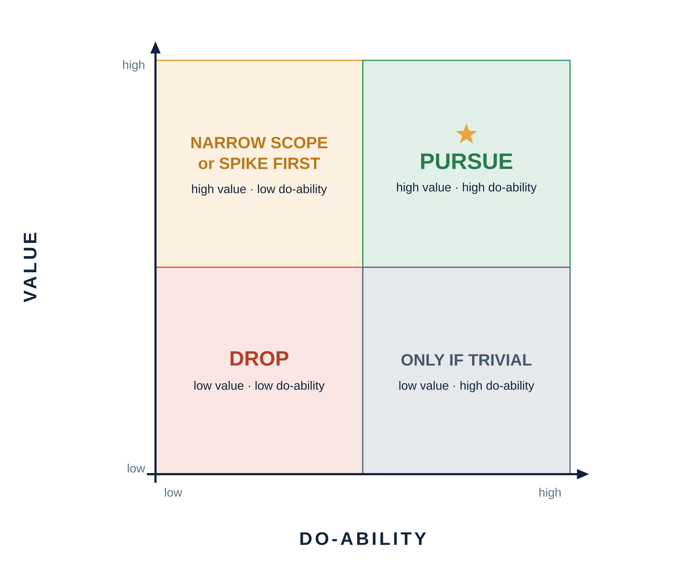

# Idea Scoring Sheet — converging on a defensible idea

*Use this in the Week 3 convergence workshop (Wed, Sep 23). The goal is to narrow to **1–2 ideas** deliberately — against a shared yardstick — not by defaulting to whichever idea you're most attached to. Score first, then get peer + instructor feedback, then choose.*

---

## Part 1 — Score each candidate against the selection criteria

Rate each idea **1 (weak) → 3 (strong)** on each criterion. The last column is a quick total (higher = stronger), but treat it as a conversation-starter, not a verdict — a fatal flaw on **real need** or **feasibility** outweighs a high total.

| Criterion | What a "3" looks like | Idea A | Idea B | Idea C |
|---|---|---|---|---|
| **Real need, reachable users** | A specific userbase with a felt, evidenced need | | | |
| **Richness / breadth** | Exercises multiple engineering dimensions | | | |
| **One-semester MVP** | A coherent vertical slice fits the real build window — roughly five weeks, out of a ~10 hrs/week that also covers class, reading, writing, and reviews | | | |
| **Feasibility** | Risks named and reducible (see risk worksheet) | | | |
| **Extensible / room to grow** | Others could join and keep building | | | |
| **Open-source-worthy** | Appropriate to build and release in the open | | | |
| **Tractable stack** | Tech you can own, explain, and support | | | |
| **Total** | | | | |

> **The two students most often miss:** *real need* and *richness*. An idea that's easy and fun to build but serves no one, or is too thin to grow, scores low here on purpose.

> **These criteria are ours, on purpose.** We chose them for founding a *lasting, open-source* project — a startup or a proposal at work would score on different things. What transfers is the **method**: score against explicit criteria, weigh value vs. do-ability, get feedback, commit. It works on any idea you'll ever pitch.

---

## Part 2 — Plot on Value vs. Do-ability

The CPS convergence tool (also known in the product world as the value/effort 2×2). Place each idea (A/B/C) in a quadrant:

- **High value + high do-ability →** your best candidates. **Pursue.**
- **High value + low do-ability →** worth it *if* you can **shrink the scope** or **run a spike** to raise do-ability. Note how.
- **Low value →** drop, however easy. Easy-but-pointless is still pointless.

**Where each idea landed — and the biggest risk for each** (pull the risk from your `Feasibility-Risk-Worksheet.md`):

- **Idea A:** quadrant _____ · biggest risk _____
- **Idea B:** quadrant _____ · biggest risk _____
- **Idea C:** quadrant _____ · biggest risk _____

---

## Part 3 — Peer feedback (capture, don't defend)

You'll do this in **small groups of 3–4.** It's a round-robin: each person gets ~4 minutes, and everyone presents once.

**How each person's turn works:**

1. **Present (~90 sec).** Your top 1–2 ideas: the user, the real need, and why it scored well. If an idea is high-value but low-do-ability, say how you'd shrink it to a buildable slice.
2. **Peers pressure-test (~2.5 min).** The group challenges the idea along three axes — *Is the need real and the user reachable? Is it feasible at one-semester scope? Is it rich enough to found on?*
3. **Each piece of feedback follows one protocol:** **affirm what's strong → name the sharpest concern → one concrete suggestion.**
4. **You capture, you don't defend.** Write down what you hear in the boxes below — don't argue or explain. You'll weigh it in Part 4.

Then rotate to the next person until everyone has gone. (Your instructor circulates and joins groups to add an instructor read.)

**What you heard about your top idea:**

- **Is the need real / user reachable?** _______
- **Feasible at one-semester scope?** _______
- **Rich enough to found on?** _______
- **The one change that would most strengthen it:** _______

---

## Part 4 — Converge: pick 1–2 and write the rationale

Weigh the scores *and* the feedback. Commit to one or two ideas to carry forward, and write a **one-line defensible rationale** for each:

> **Chosen idea:** _______

> **Rationale:** it's for _(who)_, who need _(the real need)_; feasible because _(scope/risk read)_; rich because _(dimensions it touches)_.

This is a **working direction**, not an irreversible vow — but from here, your discovery and proposal work focus here. Your chosen idea becomes your **Product Definition Brief (CP2)**, which you'll write over the weekend and turn in **Mon, Sep 28** — the gap is deliberate, so the brief reflects today's feedback.

---

*Pairs with `Feasibility-Risk-Worksheet.md`, `Learning-Plan-Template.md`, and the selection criteria (from the Session 1 deck, scored in Part 1 above). CPS source: the Value vs. Do-ability section of the CPS handbook (`resources/cps_handbook.pdf`, p. 27).*
